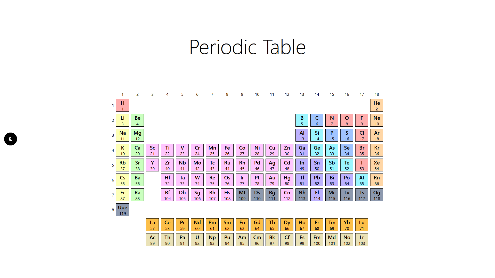

# Periodic Table

## Technologies

This project was developed using the following technologies:

- React
- Typescript

## Project

This is a simple visualization of the Periodic Table. The data is extracted from the [Periodic-Table-Json](https://github.com/Bowserinator/Periodic-Table-JSON) repository from [Bowserinator](https://github.com/Bowserinator).

## Features

- Elements colored according to its group
- Dark mode

## How to run

1. Clone the repository
2. Inside its folder, run `npm install`
3. Then, run `npm start`

## Next Steps

- Get the data using an API request
- Create a page for a deeper visualization of each element
- Organize each part of the pages in components